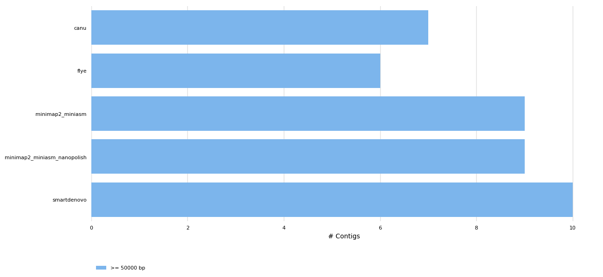
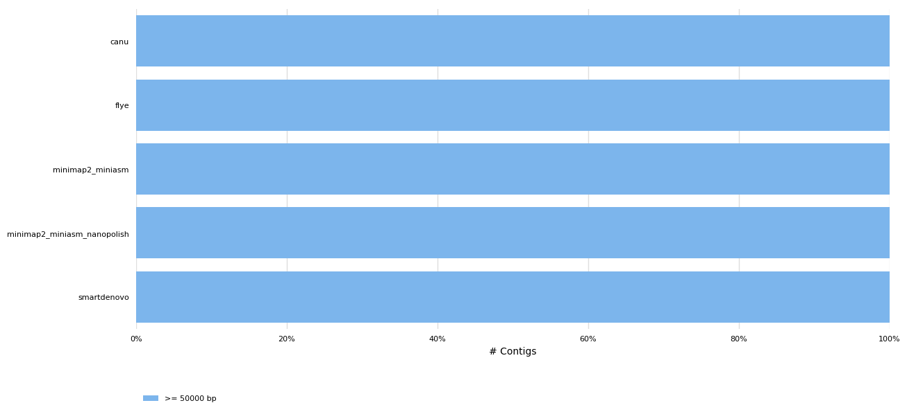
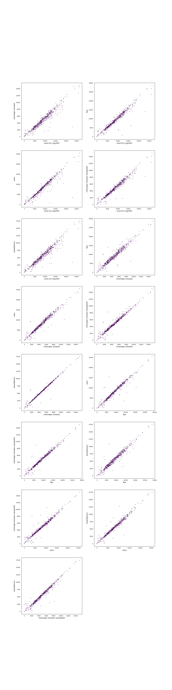
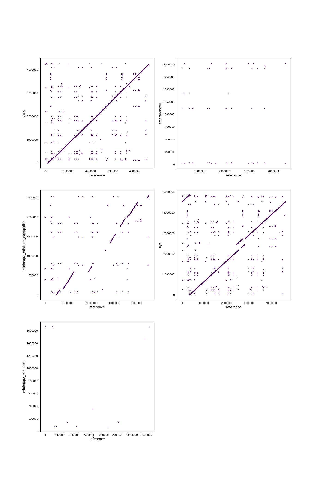

# Assembler benchmark for ONT MinION data
#### Authors: Carlos de Lannoy, data from [Loman Labs](http://lab.loman.net/2017/03/09/ultrareads-for-nanopore/)
Generated using [poreTally](https://github.com/cvdelannoy/poreTally), a benchmarking tool. For an interactive version of this report, download REPORT.html from this repository.

<h2>Abstract</h2>
        The MinION is a portable DNA sequencer that generates long error-prone reads.
         As both the hardware and analysis software are updated regularly, the most suitable pipeline for 
         subsequent analyses of a dataset generated with a given combination of hardware and software for a 
         given organism is not always clear. Here we present a benchmark for a selection of <i>de novo</i> 
         assemblers available to MinION users, on a read set of <i>Escherichia coli</i>. This benchmark is based on a 
         <a href=\>benchmarking routine</a>, designed to facilitate easy replication on a read set of choice 
         and addition of other <i>de novo</i> assembly pipelines.
        <h2>Methods</h2><h3>Readset quality assessment</h3>
        Reads in this dataset were generated on a Minion with FLO-MIN106 flowcell with SQK-RAD002 kit. The reads were basecalled 
        using Albacore 0.8.4. Prior to assembly, the quality of the untreated readset was analysed using NanoPlot (version: 1.13.0) 
        and mapped using Minimap2 (version: 2.10-r764-dirty). <h3>Assembly pipelines</h3><h4>canu</h4>Canu is a complete OLC assembly pipeline that was shown to work well for the assembly of error-prone  reads. It performs a  pre-assembly read correction, read trimming, assembly using the minhash alignment  process (MHAP) and ultimately a consensus finding step. &zwnj; &zwnj;<b>Included tools:</b><ul><li>canu (version: snapshot v1.7 +0 changes (r8692 c9ef9219a265e0bbe3a311cca7d28aa02b7517d3)) </li></ul> &zwnj;<b>Used command:</b><pre><code>${CANU} -d ${INT}/assembler_results/canu -p canu_assembly maxThreads=${NB_THREADS} useGrid=false genomeSize=$REFGENOME_SIZE -nanopore-raw ${INT}/all_reads.fasta

cp ${INT}/assembler_results/canu/canu_assembly.contigs.fasta ${INT}/assembler_results/all_assemblies/canu.fasta</code></pre><h4>smartdenovo</h4>SMARTdenovo is a long read OLC assembly pipeline that was originally intended to work with  PacBio reads, but has been shown to produce assemblies of reasonably high continuity from MinION reads as well. &zwnj; &zwnj;<b>Included tools:</b><ul><li>SMARTdenovo (version: none defined) </li></ul> &zwnj;<b>Used command:</b><pre><code>${SMARTDENOVO} -p ${INT}/assembler_results/smartdenovo/smartdenovo_assembly ${INT}/all_reads.fasta > ${INT}/assembler_results/smartdenovo/smartdenovo_assembly.mak && (make -f ${INT}/assembler_results/smartdenovo/smartdenovo_assembly.mak)
if [ -e ${INT}/assembler_results/smartdenovo/smartdenovo_assembly.cns ]; then
	cp ${INT}/assembler_results/smartdenovo/smartdenovo_assembly.cns ${INT}/assembler_results/all_assemblies/smartdenovo.fasta
elif [ -e ${INT}/assembler_results/smartdenovo/smartdenovo_assembly.dmo.lay.utg ]; then
	cp ${INT}/assembler_results/smartdenovo/smartdenovo_assembly.dmo.lay.utg ${INT}/assembler_results/all_assemblies/smartdenovo.fasta
fi</code></pre><h4>minimap2 miniasm nanopolish</h4>Minimap2 is a fast all-vs-all mapper of reads that relies on sketches of sequences, composed of minimizers. Miniasm uses the found overlaps to construct an assembly graph. As a consensus step is lacking in this pipeline, post-assembly polishing is often required. In this case, Nanopolish was used. &zwnj; &zwnj;<b>Included tools:</b><ul><li>minimap2 (version: <${MINIMAP2} -V>) </li><li>miniasm (version: <${MINIASM} -V>) </li><li>nanopolish (version: <${NANOPOLISH} --version | grep -Po '(?<=nanopolish version ).+'>) </li></ul> &zwnj;<b>Used command:</b><pre><code>${MINIMAP2} -x ava-ont -t ${NB_THREADS} ${INT}/all_reads.fastq ${INT}/all_reads.fastq | gzip -1 > ${INT}/assembler_results/minimap2_miniasm_nanopolish/minimap2.paf.gz && (${MINIASM} -f ${INT}/all_reads.fastq ${INT}/assembler_results/minimap2_miniasm_nanopolish/minimap2.paf.gz > ${INT}/assembler_results/minimap2_miniasm_nanopolish/minimap2_miniasm.gfa)
awk '/^S/{print ">"$2"\n"$3}' ${INT}/assembler_results/minimap2_miniasm_nanopolish/minimap2_miniasm.gfa | fold > ${INT}/assembler_results/minimap2_miniasm_nanopolish/minimap2_miniasm.fasta

${TOOL_DIR}/scripts/other/nanopolish_std.sh ${INT}/assembler_results/minimap2_miniasm_nanopolish/minimap2_miniasm.fasta ${INT}/extended_parameters.config ${INT}/all_reads.fastq

cp ${INT}/assembler_results/minimap2_miniasm_nanopolish/nanopolish/minimap2_miniasm_nanopolish.fasta ${INT}/assembler_results/all_assemblies/minimap2_miniasm_nanopolish.fasta</code></pre><h4>flye</h4>Flye uses A-Bruijn graphs to assemble long error-prone reads. To do so, it follows arbitrary paths through the assembly graph and constructs new assembly graphs from these paths. &zwnj; &zwnj;<b>Included tools:</b><ul><li>flye (version: 2.3.3-g47cdd0b) </li></ul> &zwnj;<b>Used command:</b><pre><code>$FLYE --nano-raw ${INT}/all_reads.fastq --genome-size ${REFGENOME_SIZE} --out-dir ${INT}/assembler_results/flye/ --threads ${NB_THREADS}

cp ${INT}/assembler_results/flye/scaffolds.fasta ${INT}/assembler_results/all_assemblies/flye.fasta</code></pre><h4>minimap2 miniasm</h4>Minimap2 is a fast all-vs-all mapper of reads that relies on sketches of sequences, composed of minimizers. Miniasm uses the found overlaps to construct an assembly graph. As a consensus step is lacking in this pipeline, post-assembly polishing is often required. &zwnj; &zwnj;<b>Included tools:</b><ul><li>minimap2 (version: 2.10-r764-dirty) </li><li>miniasm (version: 0.2-r168-dirty) </li></ul> &zwnj;<b>Used command:</b><pre><code>${MINIMAP2} -x ava-ont -t ${NB_THREADS} ${INT}/all_reads.fastq ${INT}/all_reads.fastq | gzip -1 > ${INT}/assembler_results/minimap2_miniasm/minimap2.paf.gz && (${MINIASM} -f ${INT}/all_reads.fastq ${INT}/assembler_results/minimap2_miniasm/minimap2.paf.gz > ${INT}/assembler_results/minimap2_miniasm/minimap2_miniasm.gfa)
awk '/^S/{print ">"$2"\n"$3}' ${INT}/assembler_results/minimap2_miniasm/minimap2_miniasm.gfa | fold > ${INT}/assembler_results/minimap2_miniasm/minimap2_miniasm.fasta

cp ${INT}/assembler_results/minimap2_miniasm/minimap2_miniasm.fasta ${INT}/assembler_results/all_assemblies/minimap2_miniasm.fasta</code></pre><h3>Assembly quality assessment</h3>
        Produced assemblies were analyzed and compared on continuity and agreement with the reference genome. Quast 
        (version: 4.6.2) was used to determine a wide array of quality metrics in both quality categories and produce 
        synteny plots. To elucidate any bias in the occurence of certain sequences, 5-mers in the assemblies and the 
        reference genomes were compared using Jellyfish (version: 2.2.9). Finally, results were summarized using MultiQC.
        <h2>Results</h2><h3>General Statistics</h3><table>
<thead>
<tr><th style="text-align: center;">                           </th><th style="text-align: center;"> Total length </th><th style="text-align: center;">    N50    </th><th style="text-align: center;"> indels per 100 kbp </th><th style="text-align: center;">   CPU time    </th><th style="text-align: center;"> mismatches per 100 kbp </th><th style="text-align: center;"> Genome fraction </th></tr>
</thead>
<tbody>
<tr><td style="text-align: center;">        smartdenovo        </td><td style="text-align: center;"> 2.95478e+06  </td><td style="text-align: center;">  457841   </td><td style="text-align: center;">      3776.75       </td><td style="text-align: center;">    0:27:40    </td><td style="text-align: center;">        3692.82         </td><td style="text-align: center;">      0.154      </td></tr>
<tr><td style="text-align: center;">minimap2_miniasm_nanopolish</td><td style="text-align: center;"> 2.56604e+06  </td><td style="text-align: center;">  314671   </td><td style="text-align: center;">      3255.26       </td><td style="text-align: center;">1 day, 4:26:31 </td><td style="text-align: center;">        2893.55         </td><td style="text-align: center;">     32.717      </td></tr>
<tr><td style="text-align: center;">     minimap2_miniasm      </td><td style="text-align: center;"> 2.50698e+06  </td><td style="text-align: center;">  307611   </td><td style="text-align: center;">      3881.88       </td><td style="text-align: center;">    0:00:12    </td><td style="text-align: center;">        2886.53         </td><td style="text-align: center;">      0.065      </td></tr>
<tr><td style="text-align: center;">           canu            </td><td style="text-align: center;"> 4.28217e+06  </td><td style="text-align: center;">  824286   </td><td style="text-align: center;">      2473.37       </td><td style="text-align: center;">1 day, 16:39:33</td><td style="text-align: center;">         701.92         </td><td style="text-align: center;">     95.605      </td></tr>
<tr><td style="text-align: center;">           flye            </td><td style="text-align: center;"> 4.85564e+06  </td><td style="text-align: center;">1.35387e+06</td><td style="text-align: center;">      1717.34       </td><td style="text-align: center;">    0:46:41    </td><td style="text-align: center;">         920.91         </td><td style="text-align: center;">     99.563      </td></tr>
</tbody>
</table><h3>Readset quality</h3>
<table>
<thead>
<tr><th style="text-align: center;">                          </th><th style="text-align: center;"> Value </th><th style="text-align: center;">                 </th><th style="text-align: center;"> N  </th><th style="text-align: center;">  %  </th></tr>
</thead>
<tbody>
<tr><td style="text-align: center;"> <b>Mean read quality</b> </td><td style="text-align: center;"> 10.8  </td><td style="text-align: center;"><b>mismatches</b></td><td style="text-align: center;">872 </td><td style="text-align: center;">10.9 </td></tr>
<tr><td style="text-align: center;"><b>Median read quality</b></td><td style="text-align: center;"> 11.2  </td><td style="text-align: center;"><b>deletions</b> </td><td style="text-align: center;">910 </td><td style="text-align: center;">11.38</td></tr>
<tr><td style="text-align: center;"><b>Median read length</b> </td><td style="text-align: center;"> 20763 </td><td style="text-align: center;"><b>insertions</b></td><td style="text-align: center;">258 </td><td style="text-align: center;">3.23 </td></tr>
<tr><td style="text-align: center;"> <b>Mean read length</b>  </td><td style="text-align: center;">34946.1</td><td style="text-align: center;"> <b>matches</b>  </td><td style="text-align: center;">5958</td><td style="text-align: center;">74.49</td></tr>
</tbody>
</table><h3>QUAST</h3><h4>Assembly Statistics</h4><table>
<thead>
<tr><th style="text-align: center;">                           </th><th style="text-align: center;"> Length (Mbp) </th><th style="text-align: center;"> N75 (Kbp) </th><th style="text-align: center;"> Largest contig (Kbp) </th><th style="text-align: center;"> L50 (K) </th><th style="text-align: center;"> N50 (Kbp) </th><th style="text-align: center;"> L75 (K) </th><th style="text-align: center;"> Genome Fraction </th><th style="text-align: center;"> Indels /100Kbp </th><th style="text-align: center;"> Mismatches /100Kbp </th><th style="text-align: center;"> Genes </th><th style="text-align: center;"> Genes (partial) </th><th style="text-align: center;"> Misas- semblies </th></tr>
</thead>
<tbody>
<tr><td style="text-align: center;">        smartdenovo        </td><td style="text-align: center;"> 2.95478e+06  </td><td style="text-align: center;">  204859   </td><td style="text-align: center;">     1.19863e+06      </td><td style="text-align: center;">    2    </td><td style="text-align: center;">  457841   </td><td style="text-align: center;">    5    </td><td style="text-align: center;">      0.154      </td><td style="text-align: center;">    3776.75     </td><td style="text-align: center;">      3692.82       </td><td style="text-align: center;">   7   </td><td style="text-align: center;">        1        </td><td style="text-align: center;">        0        </td></tr>
<tr><td style="text-align: center;">minimap2_miniasm_nanopolish</td><td style="text-align: center;"> 2.56604e+06  </td><td style="text-align: center;">  194314   </td><td style="text-align: center;">     1.18852e+06      </td><td style="text-align: center;">    2    </td><td style="text-align: center;">  314671   </td><td style="text-align: center;">    4    </td><td style="text-align: center;">     32.717      </td><td style="text-align: center;">    3255.26     </td><td style="text-align: center;">      2893.55       </td><td style="text-align: center;"> 1427  </td><td style="text-align: center;">       47        </td><td style="text-align: center;">        4        </td></tr>
<tr><td style="text-align: center;">     minimap2_miniasm      </td><td style="text-align: center;"> 2.50698e+06  </td><td style="text-align: center;">  190149   </td><td style="text-align: center;">     1.16168e+06      </td><td style="text-align: center;">    2    </td><td style="text-align: center;">  307611   </td><td style="text-align: center;">    4    </td><td style="text-align: center;">      0.065      </td><td style="text-align: center;">    3881.88     </td><td style="text-align: center;">      2886.53       </td><td style="text-align: center;">   5   </td><td style="text-align: center;">        1        </td><td style="text-align: center;">        0        </td></tr>
<tr><td style="text-align: center;">           canu            </td><td style="text-align: center;"> 4.28217e+06  </td><td style="text-align: center;">  553925   </td><td style="text-align: center;">     1.37499e+06      </td><td style="text-align: center;">    2    </td><td style="text-align: center;">  824286   </td><td style="text-align: center;">    4    </td><td style="text-align: center;">     95.605      </td><td style="text-align: center;">    2473.37     </td><td style="text-align: center;">       701.92       </td><td style="text-align: center;"> 4118  </td><td style="text-align: center;">       33        </td><td style="text-align: center;">        0        </td></tr>
<tr><td style="text-align: center;">           flye            </td><td style="text-align: center;"> 4.85564e+06  </td><td style="text-align: center;">  935133   </td><td style="text-align: center;">     1.75901e+06      </td><td style="text-align: center;">    2    </td><td style="text-align: center;">1.35387e+06</td><td style="text-align: center;">    3    </td><td style="text-align: center;">     99.563      </td><td style="text-align: center;">    1717.34     </td><td style="text-align: center;">       920.91       </td><td style="text-align: center;"> 4287  </td><td style="text-align: center;">       14        </td><td style="text-align: center;">        1        </td></tr>
</tbody>
</table><h4>Number of Contigs</h4>

<h3> <i>k</i>-mer Counts</h3>

<h3> Synteny Plots</h3>

